# 河原電子ビジネス専門学校 ゲームクリエイター科　　2年　東　浩樹

### 目次
* [1.概要](#概要)
* [2.操作説明](#操作説明)
* [3.担当ソースコード](#担当ソースコード)
* [4.改造したエンジンコード](#改造したエンジンコード)
* [5.技術要素](#技術要素)
  * [1.PBR（物理ベースレンダリング）](#1pbr物理ベースレンダリング)
  * [2.デプスシャドウ](#2デプスシャドウ)
    * [2.1.シャドウマップの作成](#21シャドウマップの作成)
    * [2.2.モデルに影を落とす](#22モデルに影を落とす)
  * [3.川瀬式ブルーム](#3川瀬式ブルーム)
  * [4.輪郭線の実現](#4輪郭線の実現)
* [6.こだわりと苦労した点](#こだわりと苦労した点)
  * [1.磁力について](#1磁力について)
  * [2.ライトについて](#2ライトについて)   

# 概要
## 作品名：磁力反転コロコーロ
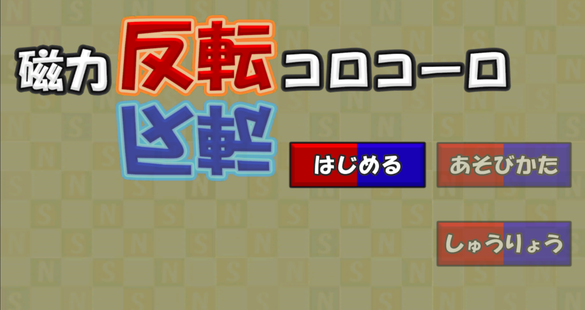
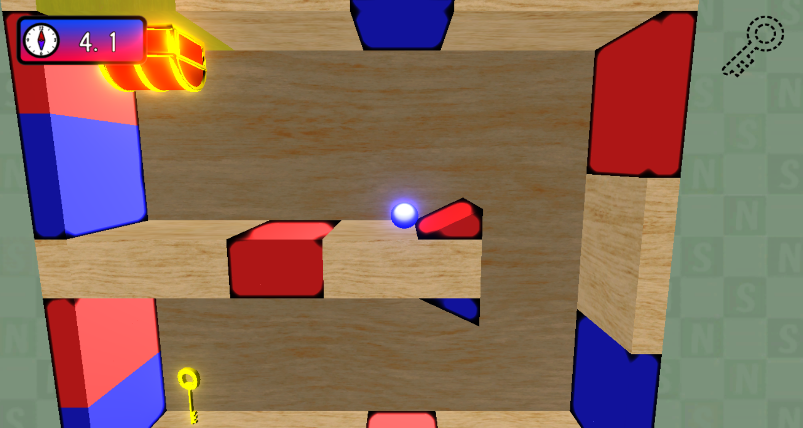

## 使用ゲームエンジン：学内エンジンを改造したもの
## 使用言語：C++、HLSL
## 使用ツール：Visual Studio 2019、3ds Max
## 使用ライブラリ：BulletPhysics、Effekseer、DirectXTK12
## 環境：Windows10、DirectX12
## 制作人数：3人
## 制作期間：4ヵ月半
## GitHub : [https://github.com/Azuki2828/MyGame](https://github.com/Azuki2828/MyGame "GitHub URL")  
# 操作説明
## Jキー or Aボタン：自機の磁極を変換  
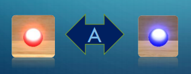   

# 担当ソースコード
BackGround.h 
BackGround.cpp 
ConstTriggerBoxValue.h 
ConstValue.h 
DeathBlock.h 
DeathBlock.cpp 
DirectionLight.h 
DirectionLight.cpp 
FontRender.h 
FontRender.cpp 
HUD.h 
HUD.cpp 
Key.h 
Key.cpp 
LightBase.h 
LightBase.cpp 
LightCamera.h 
LightManager.h 
LightManager.cpp 
Magnet.h 
Magnet.cpp 
main.h 
MainCamera.h 
MainCamera.cpp 
Player.h 
Player.cpp 
RuleSceneConstData.h 
SaveData.h 
SaveData.cpp 
Seesaw.h 
Seesaw.cpp 
SkinModelRender.h 
SkinModelRender.cpp 
SoundManager.h 
SoundManager.cpp 
SpriteRender.h 
SpriteRender.cpp 
TreasureBox.h 
TreasureBox.cpp  

deferredLighting.fx 
gaussianBlur.fx 
model.fx 
postEffect.fx 
sprite.fx 
drawShadowMap.fx 
shadowReciever.fx 
Zprepass.fx 

また、上記含め、全てのコードのリファクタリングを担当。   

# 改造したエンジンコード 
RenderTarget.h(G-Buffer用のレンダーターゲットの作成及び取得を行う関数、データメンバを追加) 
RenderTarget.cpp(静的メンバの初期化を行うコードを追加) 
tkSoundSource.cpp(ファイルパスが通らなかった時に警告を出すコードを追加) 
Vector.h(BulletPhysicsに対応する関数、インクルードを追加)   

# 技術要素
## 1.PBR（物理ベースレンダリング）

本作品ではディズニーベースのPBRを実装しており、**フレネル反射を考慮した拡散反射**、**クックトランスモデル利用したスペキュラ反射**を用いています。ランバート拡散反射では、入射してきた光よりも強い光を返すため、物理的に正しくはありませんでした。その値はπ倍であることが知られています。そのため、本作品ではその値をπで割った**正規化ランバート拡散反射**を採用しています。鏡面反射では、物体の金属度、なめらかさのパラメータを元に鏡面反射率を求めています。フォン鏡面反射ではこのパラメータが無かったため、視点からサーフェイスに伸びるベクトルと反射ベクトルしか鏡面反射に使うネタがありませんでした（絞り率は定数とする）。今回は各物体ごとにパラメータを設定し、不自然な金属感を出さないようにしています。これにより、エネルギー保存則に従ったライティング処理を実装しました。   
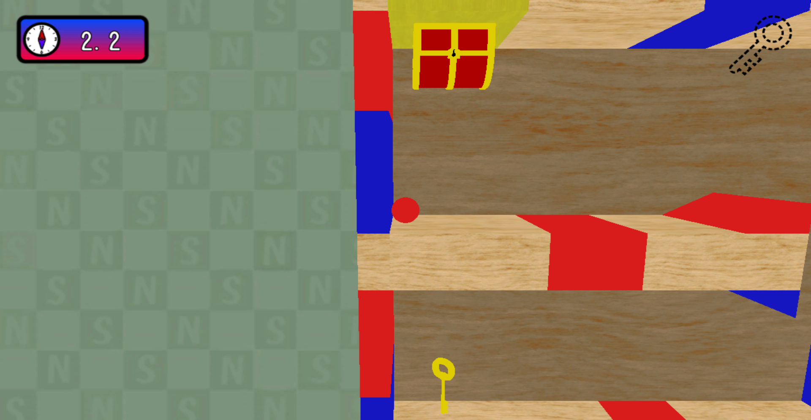 
▲テクスチャカラーによるゲーム画面 
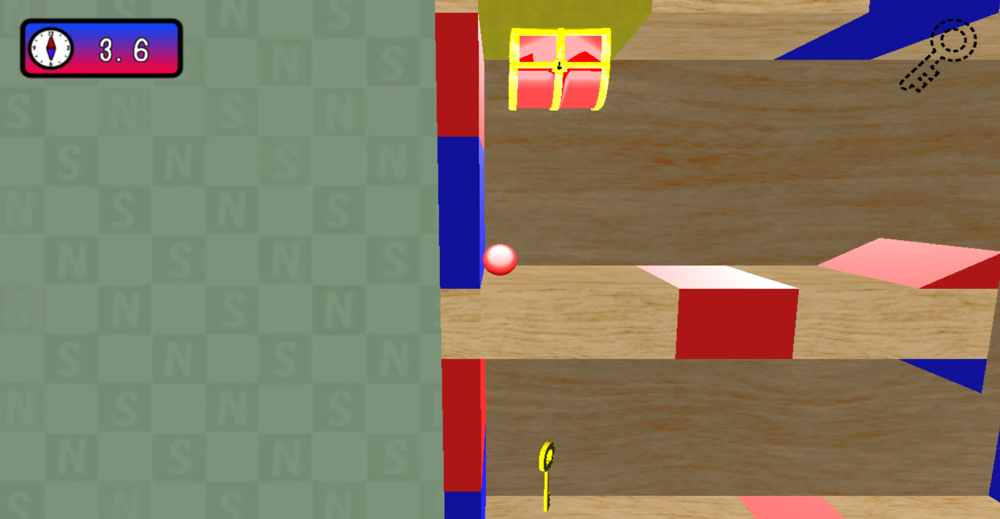 
▲PBR実装後のゲーム画面   

## 2.デプスシャドウ
 
影を生成する手法として、デプスシャドウを採用しています。投影シャドウではグレースケールをシャドウマップに描き込んでいましたが、ライトスクリーン空間でのZ値（深度値）をシャドウマップに描き込むように切り替えることにより、投影シャドウの欠点であった、「影が落ちないはずの場所に影が落ちてしまう」現象を克服しました。   
以下がデプスシャドウの手順になります。   

### 2.1.シャドウマップの作成

1.シャドウマップ用のレンダーターゲットを作成する 
2.ライトの位置にカメラを設置する 
3.シャドウマップ描画用のモデルを用意する 
4.シャドウマップ用のピクセルシェーダーを用意する 
5.シャドウマップに用意した影用モデルを描画する  

今回はデプスシャドウなので、シェーダー側では、**ライトからみた深度値を書き込みます**。 

▼深度値が書き込まれたシャドウマップ 
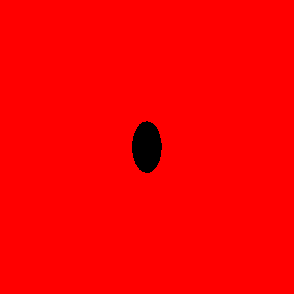

### 2.2.モデルに影を落とす
 
シャドウマップが出来たら、いよいよ影の描画に入ります。
手順は以下のようになります。  
1.定数バッファにライトカメラのビュープロジェクション行列を登録する 
2.シャドウマップをシェーダーリソースビューに登録する 
3.ライトビュースクリーン空間での座標を計算する 
4.正規化スクリーン座標系に変換する 
5.正規化スクリーン座標系からUV座標系に変換する 
6.ライトビュースクリーン空間でのZ値を計算する 
7.範囲内なら、シャドウマップに書き込まれているZ値と比較して影を落とす 

  
▼シャドウなし 
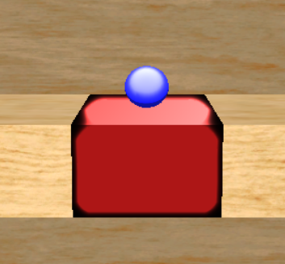 
▼デプスシャドウあり 
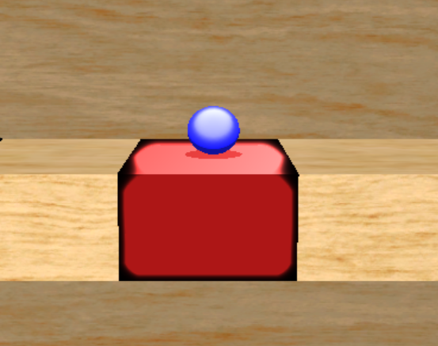  

## 3.川瀬式ブルーム
 
ぼかし表現にはガウシアンブラーを使用していますが、このブラーを一度だけでなく、複数回使用しています。その際に、ダウンサンプリング用のレンダリングターゲットを用意して、ガウスフィルターをかけて縮小します。それらを同解像度に拡大合成することであふれテクスチャを生成し、絶妙なブルームに仕上げています。  
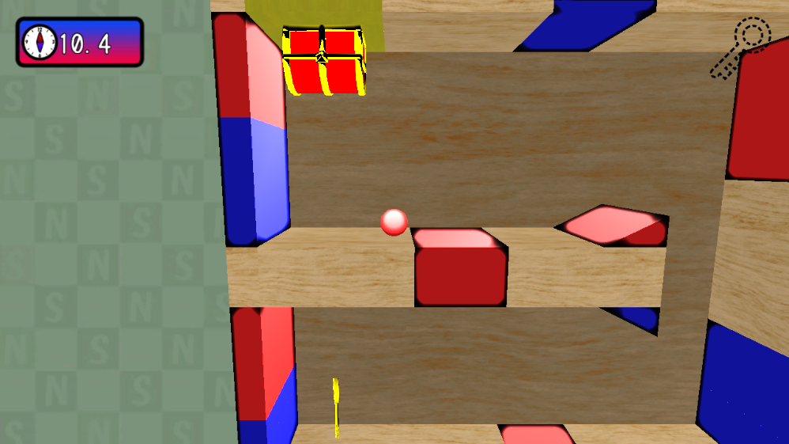 
▲ブルームをかける前の画面   
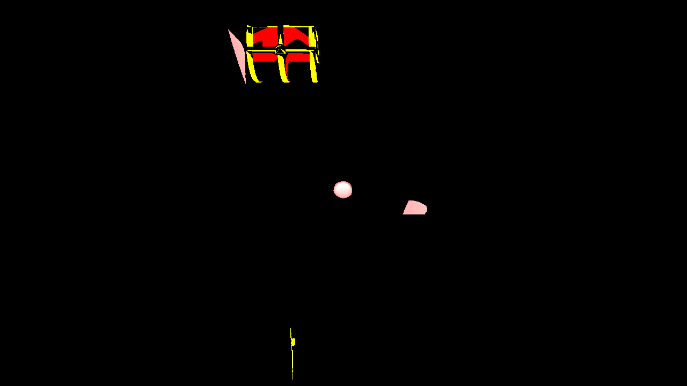 
▲輝度テクスチャ   
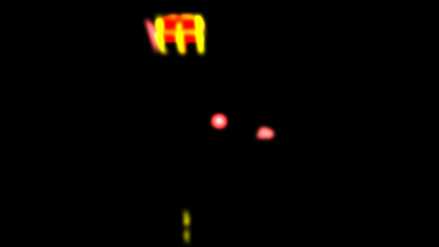 
 
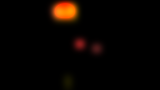 
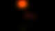 
▲輝度テクスチャを使用して４回ガウシアンブラーをかける。   
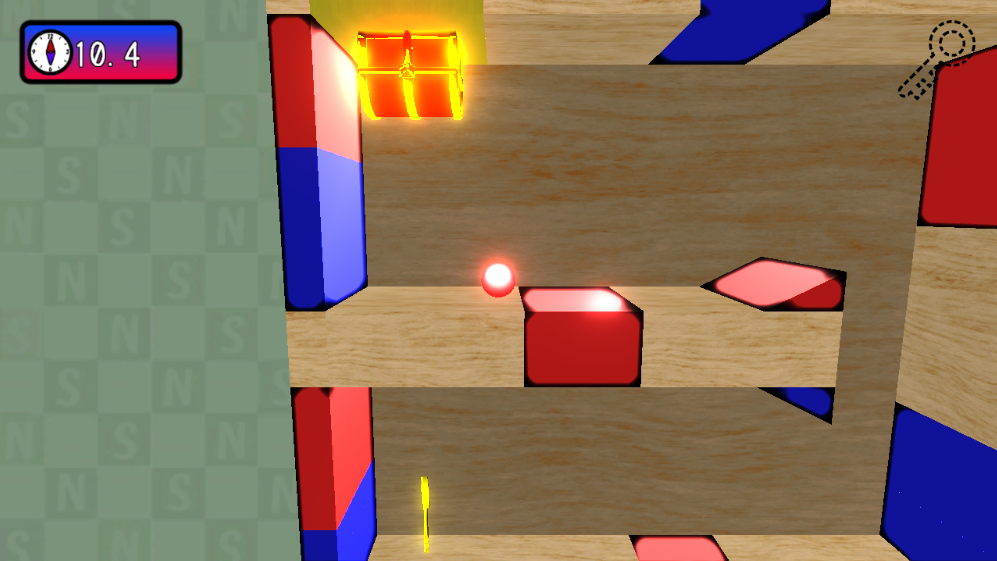 
▲ブルームをかけた後のゲーム画面
   

## 4.輪郭線の実現
 
輪郭線の実現のために、法線テクスチャ（G-Buffer）を生成しています。この法線テクスチャでは、あるテクセルの法線情報と周囲８テクセルの法線情報を比較し、その内積で、オブジェクトの角に近いか判定しています。  
 
 
 
 
▼法線テクスチャ 
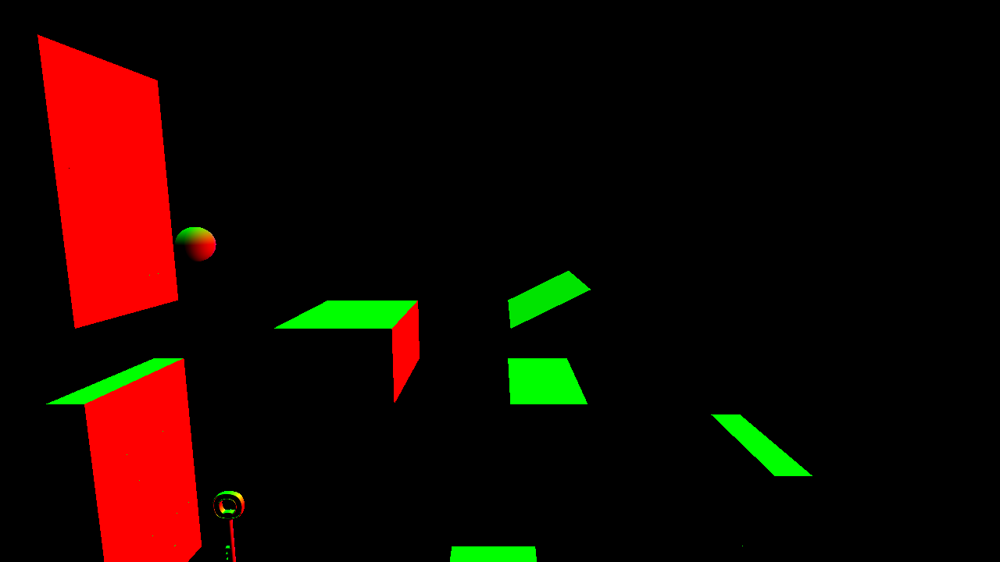 
▼磁石の縁が黒くなっている。 

   

# こだわりと苦労した点

## 1.磁力について

プレイヤーは、磁石から受ける磁力で自機を進めていきます。そのため、ゴールするためには磁力の強さや自機の質量、摩擦などを調整する必要がありました。しかしそれ以上に問題だったのが磁力の影響範囲です。かつては自機と磁石の距離で磁力計算をしていました。そのため、ステージ全体に磁石が設置されていることもあり、想定していない磁石からも磁力を受けてしまい、まともに進めないということが起きてしまいました。そこで、**磁力の影響範囲を、距離ではなくトリガーボックスを用いて行う**ことにしました。   
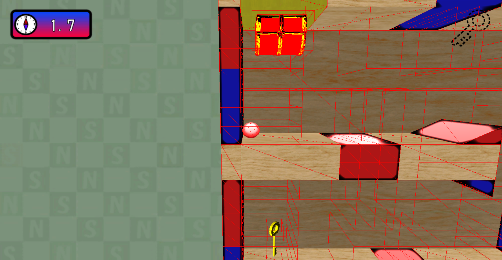 ▲赤線が影響範囲を示している   
各磁石ごとに影響範囲を決めることで、ステージギミックも作りやすくなり、不自然な動きも抑えることができました。  

## 2.ライトについて

このゲームは、各モデルごとに固有のライトを割り当てています。そのため、ステージが回転したときに全てのライトを半回転させる必要がありました。そこで、**事前に半回転用のイベントを作成しておき、カメラが半回転すると同時にそのイベント（関数）を呼ぶ**ことで、無駄の少ない処理にすることができました。