# 河原電子ビジネス専門学校 ゲームクリエイター科　　2年　東　浩樹

### 目次
* [1.概要](#概要)
* [2.操作説明](#操作説明)
* [3.担当ソースコード](#担当ソースコード)
* [4.改造したエンジンコード](#改造したエンジンコード)
* [5.技術要素](#技術要素)
  * [1.PBR（物理ベースレンダリング）](#1pbr物理ベースレンダリング)
  * [2.TBR（タイルベースレンダリング）](#2tbrタイルベースレンダリング)
    * [2.1.ライトカリング](#21ライトカリング)
  * [3.ディファードレンダリング（遅延レンダリング）](#3ディファードレンダリング遅延レンダリング)
    * [3.1.ディファードレンダリングの欠点](#31ディファードレンダリングの欠点) 
  * [4.VSM（分散シャドウマップ）](#4vsm分散シャドウマップ)
 
  * [5.FXAA（アンチエイリアシング）](#5fxaaアンチエイリアシング)
  * [6.C++とPythonの連携](#6cとpythonの連携)
* [6.こだわり・工夫した点・苦労した点](#こだわり工夫した点苦労した点)
  * [1.IBLについて](#1iblについて) 
  * [2.ボス戦時のカメラの揺れ](#2ボス戦時のカメラの揺れ)
  * [3.調整を重ねたグラフィック](#3調整を重ねたグラフィック)
 

# 概要
## 作品名：YAMIDAMA
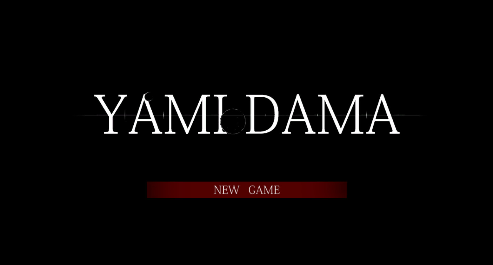

## 使用ゲームエンジン：学内エンジンを改造したもの
## 使用言語：C++、HLSL、Python
## 使用ツール：Visual Studio 2019、3ds Max、Adobe Photoshop Elements 2020、Effekseer
## 使用ライブラリ：BulletPhysics、Effekseer、DirectXTK12
## 環境：Windows10、DirectX12
## 制作人数：1人
## 制作期間：5ヵ月
## GitHub : [https://github.com/Azuki2828/AzukiGames](https://github.com/Azuki2828/MyGame "GitHub URL")  
# 操作説明
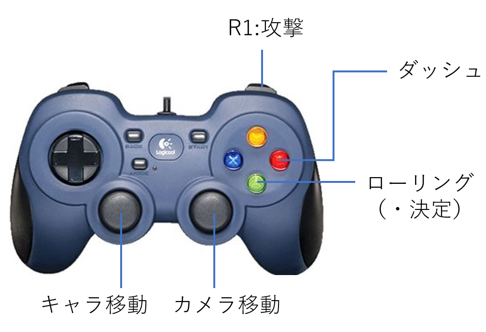 
Aボタン・Jキー：**ローリング、決定** 
Bボタン・Kキー：**ダッシュ** 
R1ボタン・７キー：**攻撃** 
右スティック・方向キー：**カメラ移動** 
左スティック・WASDキー：**キャラ移動** 
 

# 担当ソースコード
* エンジン部分（C++）
  * FontRender.cpp 
  * FontRender.h 
  * DirectionLight.cpp 
  * DirectionLight.h 
  * LightBase.cpp 
  * LightBase.h 
  * LightCulling.cpp 
  * LightCulling.h 
  * Lightmanager.cpp 
  * LightManager.h 
  * PointLight.cpp 
  * PointLight.h 
  * Bloom.cpp 
  * Bloom.h 
  * FXAA.cpp 
  * FXAA.h 
  * GaussianBlur.cpp 
  * GaussianBlur.h 
  * PostEffect.cpp 
  * PostEffect.h 
  * PostEffectComponentBase.cpp 
  * PostEffectComponentBase.h 
  * ShadowMap.cpp 
  * ShadowMap.h 
  * SoundManager.cpp 
  * SoundManager.h 
  * Fade.cpp 
  * Fade.h 
  * GameTime.h 
  * ModelRender.cpp 
  * ModelRender.h 
  * RenderingEngine.cpp 
  * RenderingEngine.h 
  * SpriteRender.cpp 
  * SpriteRender.h  
* エンジン部分（HLSL）
  * bloom.fx 
  * deferredLighting.fx 
  * drawShadowMap.fx 
  * gaussianBlur.fx 
  * lightCulling.fx 
  * model.fx 
  * sprite.fx  
* ゲーム部分（C++）
  * Boss.cpp 
  * Boss.h 
  * BossAttackCollisionDetection.cpp 
  * BossAttackCollisionDetection.h 
  * FirstWinEnemy.cpp 
  * FirstWinEnemy.h 
  * FirstWinEnemyAttackCollisionDetection.cpp 
  * FirstWinEnemyAttackCollisionDetection.h 
  * Enemy.cpp 
  * Enemy.h 
  * Item.cpp 
  * Item.h 
  * Player.cpp 
  * Player.h 
  * PlayerAction.cpp 
  * PlayerAction.h 
  * PlayerAnimation.cpp 
  * PlayerAnimation.h 
  * PlayerStateProcess.h 
  * PlayerTriggerBox.cpp 
  * PlayerTriggerBox.h 
  * AppearSprite.cpp 
  * AppearSprite.h 
  * AttackCollision.cpp 
  * AttackCollision.h 
  * BackGround.cpp 
  * BackGround.h 
  * ConstValue.h 
  * Door.cpp 
  * Door.h 
  * Game.cpp 
  * Game.h 
  * GameHUD.cpp 
  * GameHUD.h 
  * GameTitle.cpp 
  * GameTitle.h 
  * main.cpp 
  * MainCamera.cpp 
  * MainCamera.h 
  * stdafx.h  
* ゲーム部分（Python）
  * BossDeath.py 
  * BossIdle.py 
  * BossJumpAttack.py 
  * BossMove.py 
  * BossScream.py<pr>
  * BossStart.py 
  * BossSwipingAttack.py 
  * EnemyAttack.py 
  * EnemyAttackBreak.py 
  * EnemyBack.py 
  * EnemyDamage.py 
  * EnemyDeath.py 
  * EnemyIdle.py 
  * EnemyMove.py  

# 改造したエンジンコード
 * MapChip.cpp(l.14～/コリジョンオブジェクトか通常オブジェクトを判断して配置するコードを追加)
 * MapChip.h(l.36～/データメンバを追加)
 * Vector.h(l.3、l.154～、l.479～/bulletPhisicsに対応する関数を追加)
 * SkyCube.cpp(l.35～/キューブマップモデルをフォワードレンダリングで描画できるように改造)
 * SkyCube.h(l.75～/データメンバを追加)
 * tkSoundSource.cpp(l.92～/wavファイルを読み込めなかった時にエラーを出すコードを追加)
 * TkmFile.cpp(l.220～/ロードしたファイルを保存、読み込みできるように改造)
 * TkmFile.h(l.21～/データメンバを追加)
 * Material.cpp(l.13～/ロードしたファイルを保存、読み込みできるように改造)
 * Material.h(l.30～/メンバ関数、データメンバを追加)
 * MiniEngine.h(l.70～/プリプロセッサ(include)を追加)
 * RenderContext.h(l.410～/描画モードのセッターとゲッターを追加)
 * RenderTarget.cpp(l.5～l.6/静的メンバの初期化を行うコードを追加)
 * RenderTarget.h(l.11～/列挙型のG-Bufferリストを追加、レンダーターゲットの初期化と取得を行うメンバ関数を追加、シャドウマップの初期化と取得を行うメンバ関数を追加)
 * Sprite.cpp(l.256/乗算カラーを設定するコードを追加)
 * sprite.h(l.123～/乗算カラーを設定する関数とデータメンバを追加)
 * tkEngine.h(l.31～/ロードしたファイルを保存、読み込みできる関数、データメンバを追加)  
※行は22/02/02時点のものである。

# 技術要素
## 1.PBR（物理ベースレンダリング）

　今回のゲームは、グラフィック表現が魅せるポイントとなっている。よって、ライティングが非常に重要だった。Phongの反射モデルを使用した鏡面反射は物理的に正しいシェーダーではなく、各モデルのライティング調整をするには、専用のライトを作る必要があった。そこで起用したのが、ウォルト・ディズニー社が開発した **Disney based PBR**である。Disney based PBRは各パラメータを調整することで様々な表現をするので、ライトをモデルごとに分ける必要がない。フレネル反射を考慮した拡散反射、クックトランスモデルを利用した鏡面反射で、凝ったグラフィックを実現させた。以下の画像は、ライティングを一切行っていないゲーム画面とDisney based PBRを用いてライティングを行ったゲーム画面である（ポストエフェクトは使用しない）。
  
▼ライティングなし（テクスチャカラー） 
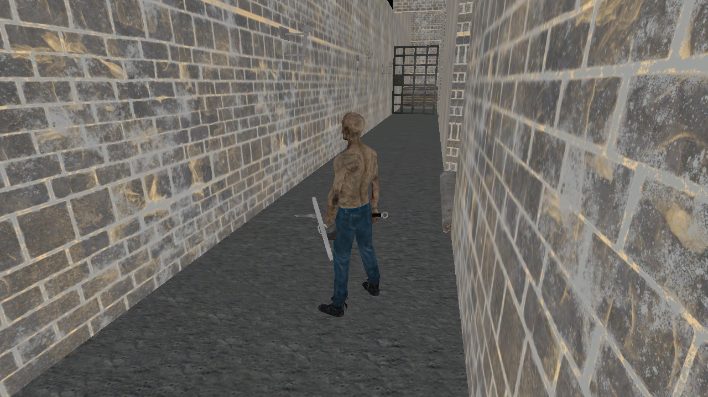
 
▼ライティングあり 
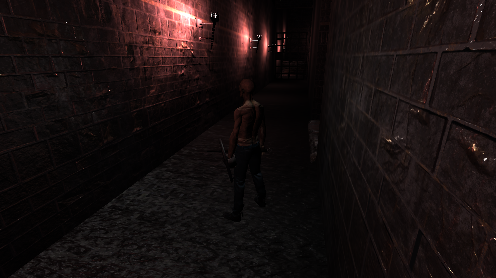
  

## 2.TBR（タイルベースレンダリング）
 
本作品は、砦内の空気感を引き立たせるために、ポイントライト（点光源）を多少強く設定してある。逆に、ディレクションライト（平行光源）は弱く設定してあるため、砦内を魅せるためにはたくさんのポイントライトを配置する必要があった。  
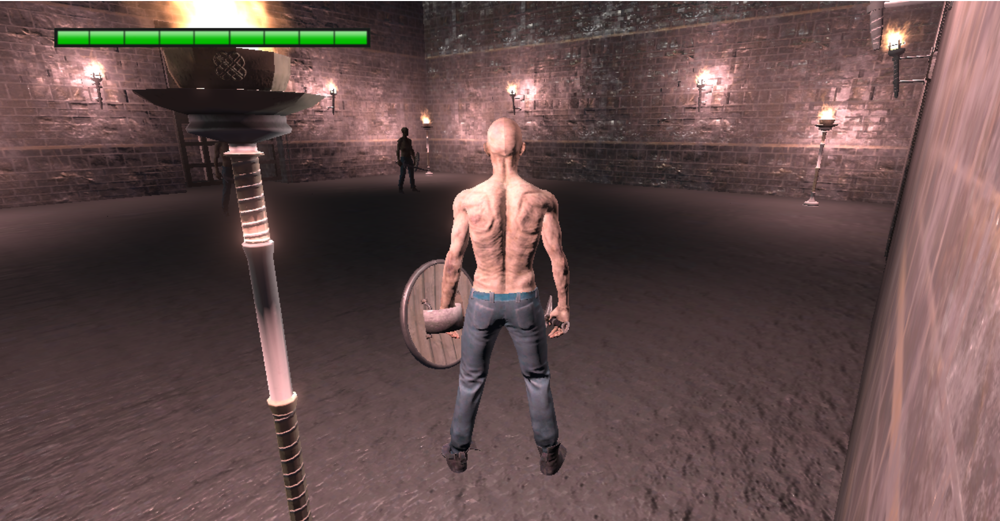
 
▲いくつも配置されたポイントライト
   
実際、この砦には60個以上のポイントライトが配置されている。そこで問題になってくるのが処理速度だ。1080×720の解像度の場合、ピクセルの数は1080×720=777600になり、ポイントライトが60個だと、777600×60=約4600万回を１フレームに計算することになる。ただこれは現状この数で済んでいるだけで、仮に1920×1080の解像度で1000個のポイントライトを配置した場合は、計算量は約20億回にまで増えてしまう。そうなるとゲームはまともにプレイできないだろう。そこで今回実装したのが、**TBR（タイルベースドレンダリング）** である。
  

### 2.1.ライトカリング

では、どうやって多くのポイントライトの処理を高速で行うのか。このTBRにおいてキモとなるのが**ライトカリング**である。これは、**スクリーンをタイル状に分割し、各タイルごとに影響を与える可能性のある光源のリストを作成する**ものである。もう少し分かりやすく言うと、**各タイルでポイントライトとの当たり判定を行い、衝突しているポイントライトだけ計算処理をする**ということだ。
 
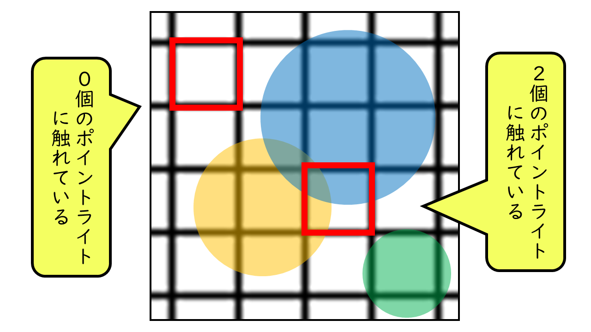 
▲各タイルごとにポイントライトとの当たり判定をとる。 
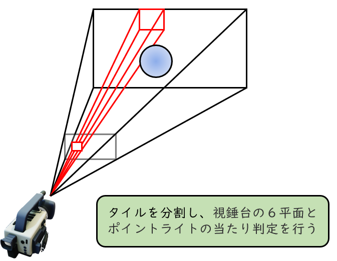
 
▲視錘台とポイントライトの当たり判定をとる 
 
本来ならば、全てのタイルで全てのポイントライトの影響を計算していたのが、**そのタイルに必要なポイントライトだけの計算で済む**ようになるわけだ。つまり、ポイントライトと全く接していないタイルでは計算をそもそもする必要がないため処理を行わない。 
以下、ライトカリングを行うまでの手順である。  
1.シーンの深度値テクスチャを作成する(本作品ではディファードレンダリングと融合したTBDRを実装しているため、G-Bufferを使用) 
2.深度値テクスチャ、タイルごとのポイントライトの番号のリストを出力するUAV、カメラの情報、ライトの情報をディスクリプタヒープに登録[^1] 

3.ライトカリングのコンピュートシェーダーをディスパッチ 
------------------------ここからシェーダー側------------------------  

4.共有メモリを初期化 
5.全てのスレッドがここまでの処理が終わるまで同期[^2] 
6.そのタイルでの最大深度・最小深度を求める 
7.タイルの視錘台を構成する6つの平面を求める 
8.タイルとポイントライトの衝突判定を行う 
9.ライトのインデックスを出力バッファに出力 
10.影響リストの終端に番兵を設定 
11.影響リストを元に、そのタイルでのポイントライトの計算を行う   

## 3.ディファードレンダリング（遅延レンダリング）
　オブジェクトを配置していると、ライティングで無駄な処理が生まれることがある。それはカメラから見て物体が重なっているときである。
 
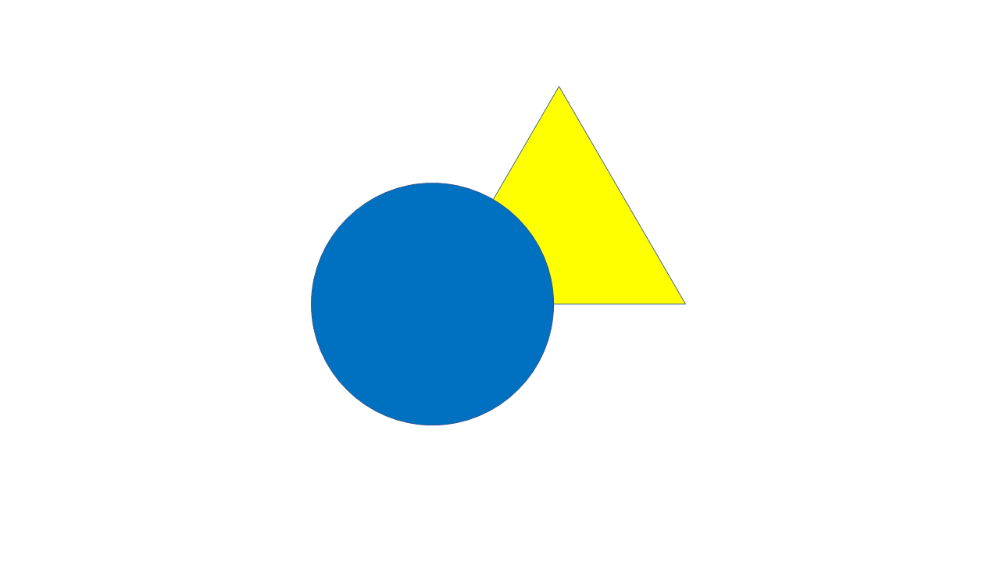
 
　こういった場合、先に描画した三角形の一部が隠れてしまうため、その部分で行ったライティング処理が無駄になる。
 
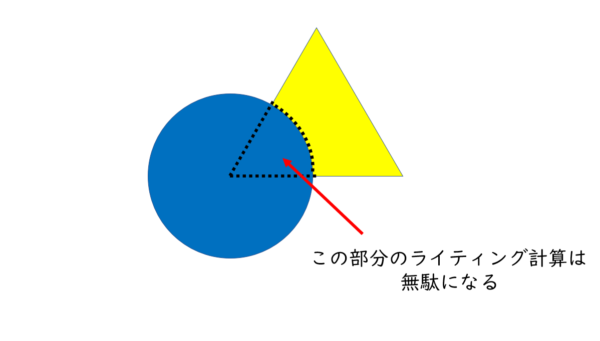
 
　そのため本作品では、ライティング計算を後で行うディファードレンダリングを採用している。そうすることでオブジェクトの配置場所、量に関係なく、一定の回数でライティング計算を行うことができる。 
　しかし、ディファードレンダリングを行うにはいくつかの情報を先に書き出す必要がある。これは**G-Buffer**と呼ばれるもので、**MRT（マルチレンダリングターゲット）** で作られる複数のテクスチャであり、後にライティングを行うための情報になる。以下の画像は本作品のシーンの一部のG-Bufferである。
 
▼テクスチャカラー 
 
▼法線 
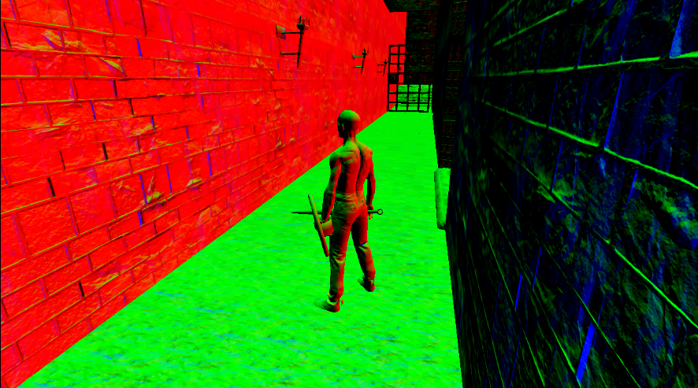 
▼ワールド座標 
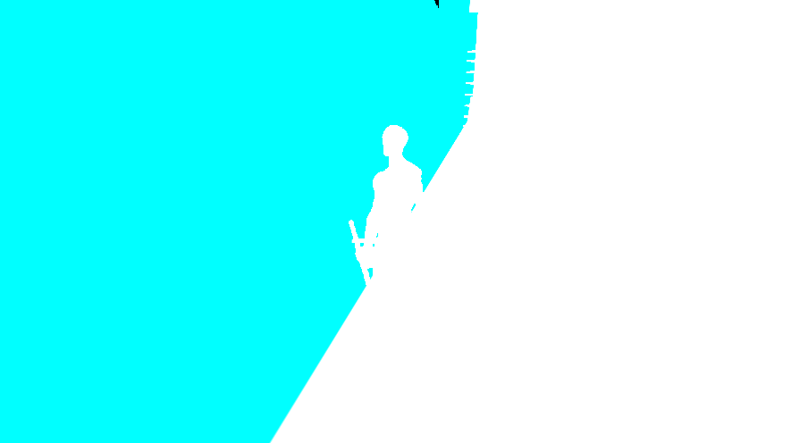 
▼滑らかさと金属度 
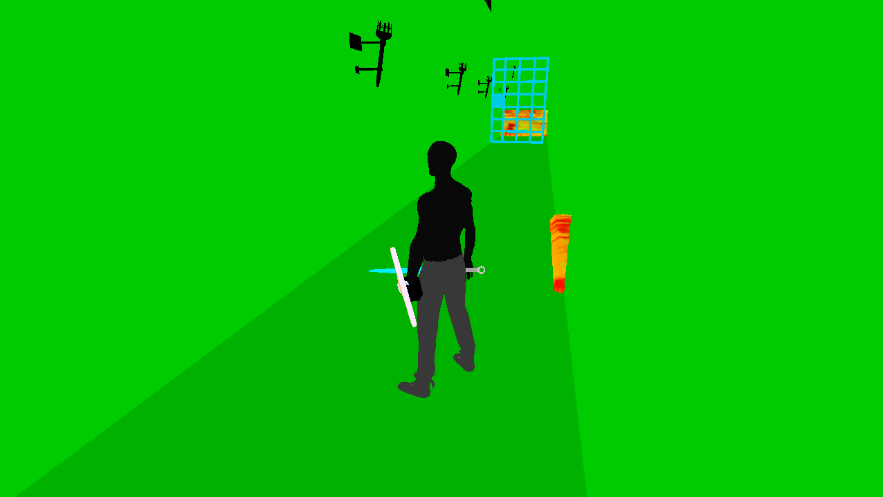 
 
これらのG-Bufferを元にライティングされたものが以下の画像である。
 
▼ライティング後のシーン

 

### 3.1.ディファードレンダリングの欠点

　しかし、**ディファードレンダリングは半透明描画が出来ない**という問題を抱えている。もし半透明描画をしようと思った場合、手前にある半透明オブジェクトと奥にあるオブジェクト、どちらもライティング計算をしなくてはいけない。具体的には法線が必要になる。しかし、ディファードレンダリングではG-Bufferを使って法線マップを作成するため、ピクセルには一つの値しか書き込むことができない。そのため、半透明オブジェクトを描画するには、他の手段を取る必要がある。そこで、本作品は**ディファードレンダリングとフォワードレンダリングを組み合わせたハイブリッドエンジン**を実装している。これは、ディファードレンダリングを行った後で、フォワードレンダリングしたモデルを加算合成するというものだ。本作品に半透明オブジェクトは出てこないが、空を表現する際に必要になった。
 
　空を表現する時にはキューブマップを使用したが、もし先にディファードレンダリングで描画すると、当然G-Bufferにその情報が書き込まれることになる。そうすると、空までライティングの影響を受けてしまう。そのため、本作品では、空に関してはフォワードレンダリングで表現している。

　ディファードレンダリングの欠点として、MRTを活用しているため、**メモリ使用量が増える**問題がある。さらに、複数のG-Bufferに書き込む関係上、**書き込み速度にも注意が必要**だ。

## 4.VSM（分散シャドウマップ）
本作品はソフトシャドウとして**VSM（分散シャドウマップ)** を実装している。これは影生成で発生したジャギーを和らげるものだ。**PCF**は近辺４テクセルの平均を取って遮蔽率を計算し、線形補間で影の縁を和らげるものだが、これではジャギーを消すには足りなかった。
そこで実装したのがVSMである。 
VSMは「シャドウマップをいくつかのブロックに分け、その分散を利用して影を和らげる」というものだ。まずは、シャドウマップをいくつかのブロックに分けたいので、シャドウマップにガウシアンブラーをかけてテクスチャを縮小させる。これにより、周囲のテクセルの値と混ざったテクスチャが出来上がり、この混ざったところが分散を求めるブロックになる。
  
▼ガウシアンブラーをかけたシャドウマップをいくつかのグループに分けた図 
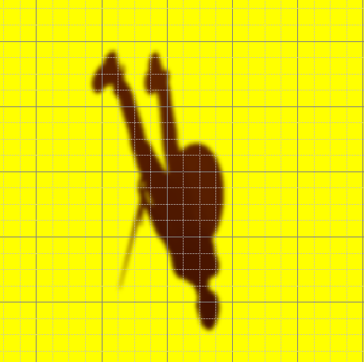
  
▼グループごとの深度値の分散を考える 
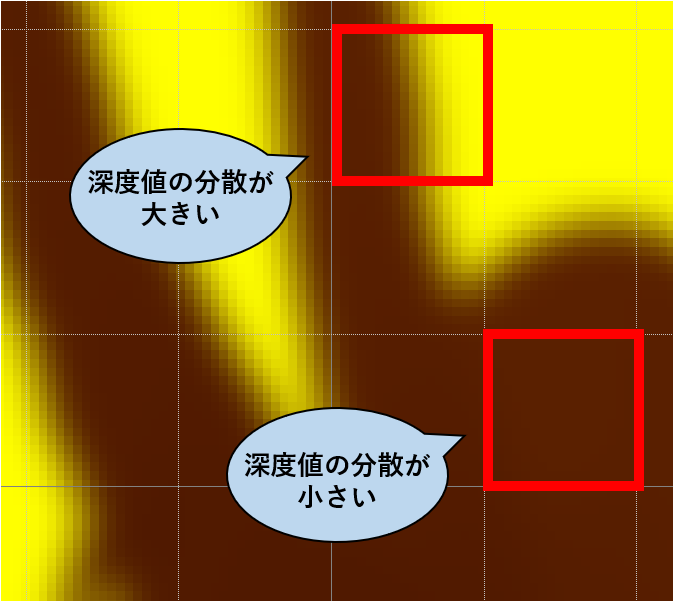
  
この分散を使って、光が届く確率を求め、影を落とすというのがVSMである。分散が小さい=影が薄くなる、分散が大きい時=ほぼ光が遮断されているので、影が濃くなる、というわけだ。
 
分散を求める式は以下である。 
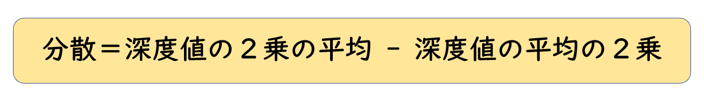 
深度値はライトカメラの情報と合わせて得ることができる。 
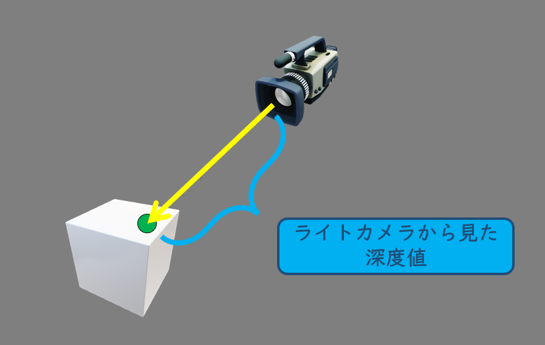 

影を落とすときは、**チェビシェフの不等式**を使っている。このチェビシェフの不等式は**分散**と**ライトから見た深度値とシャドウマップの平均の深度値の差**を用いて光が届く確率を求めるというものだ。 
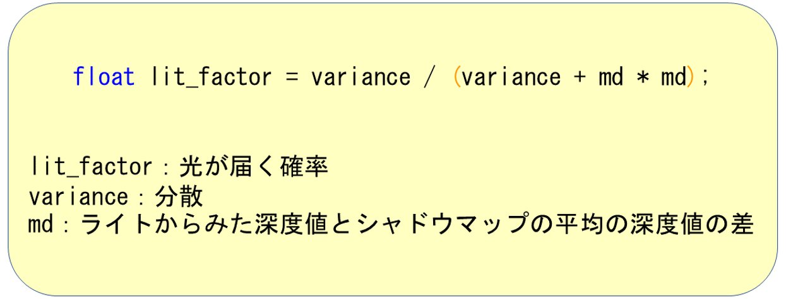 
▲チェビシェフの不等式を使って光が届く確率を求める。
 

**lit_factor**と**variance**の関係は以下のようになる（**md**は0.5とする）。 
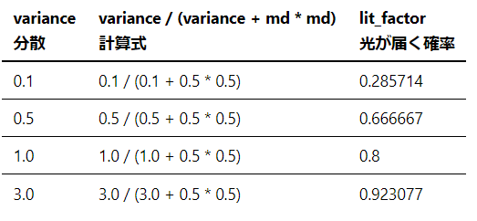 
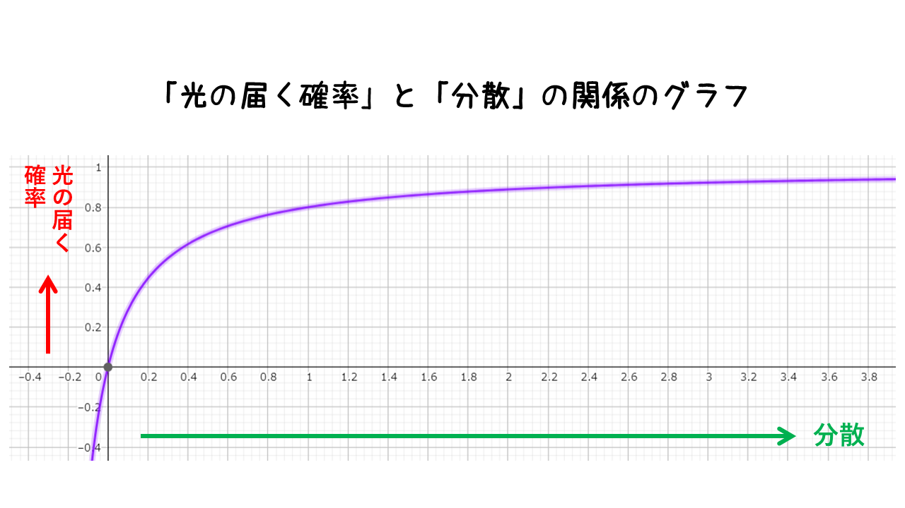 

**lit_factor**と**md**の関係は以下のようになる（**variance**は0.5とする）。 
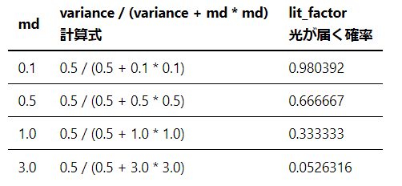 
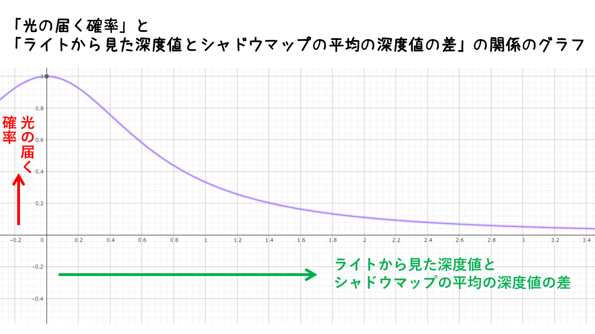 

後は、求まった確率をライトの強さに乗算すればVSMは完了だ。
以下、実際にVSMを使ったシーンを一部拡大したものである。 
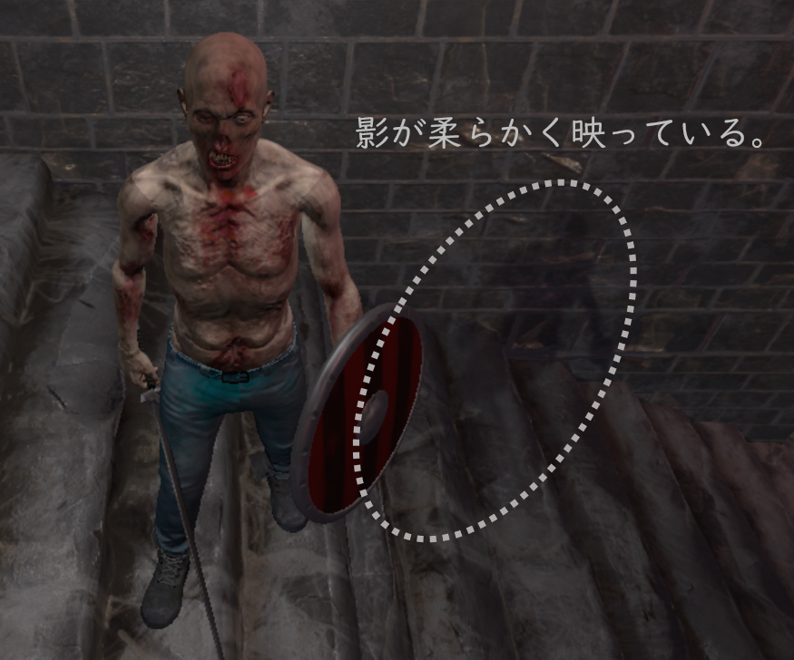   

## 5.FXAA（アンチエイリアシング）
ジャギーの問題は影だけではない。モデルに関しても、ジャギーは発生する。 
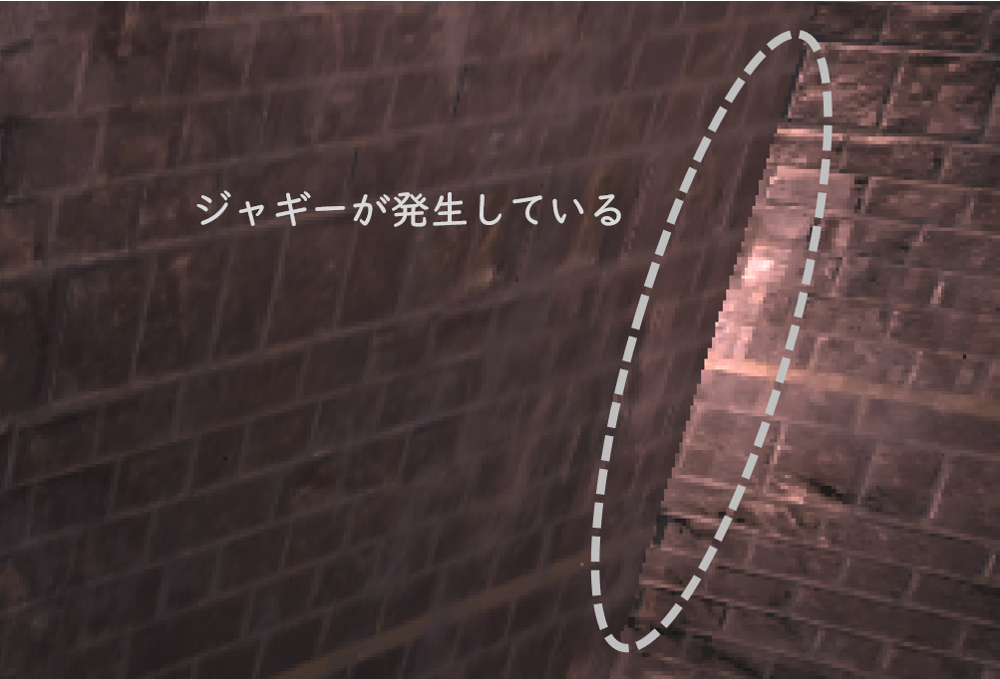 
▲角の部分でジャギーが発生している。
 
ジャギーは"オブジェクトと背景"など、輝度差が大きくなりやすいところで発生しやすい。そこで、近辺４テクセルの輝度を調べて、ブレンドすることで、ジャギーを軽減しようというのが**FXAA**である。
 
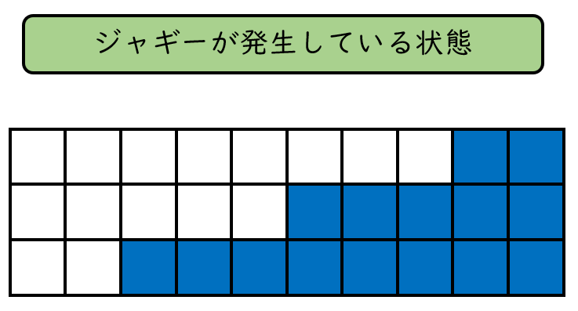 
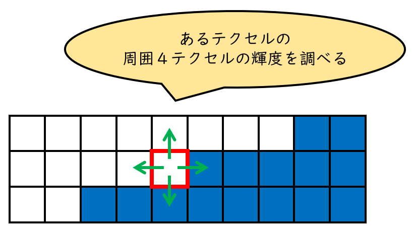 
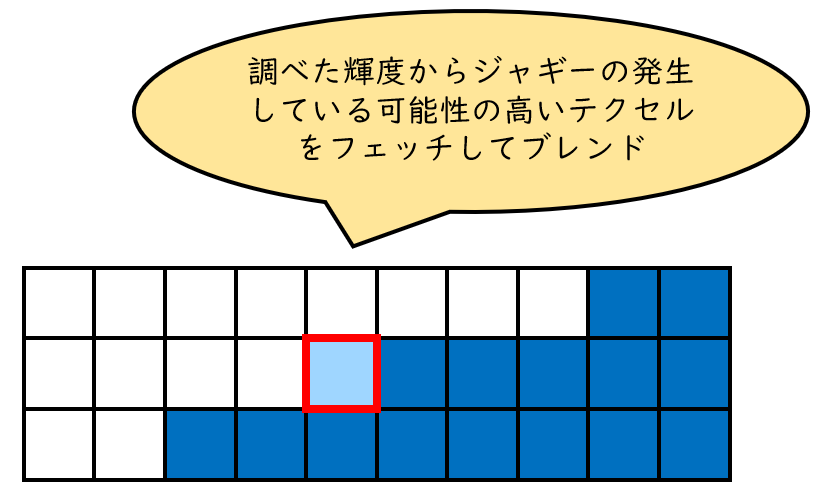 
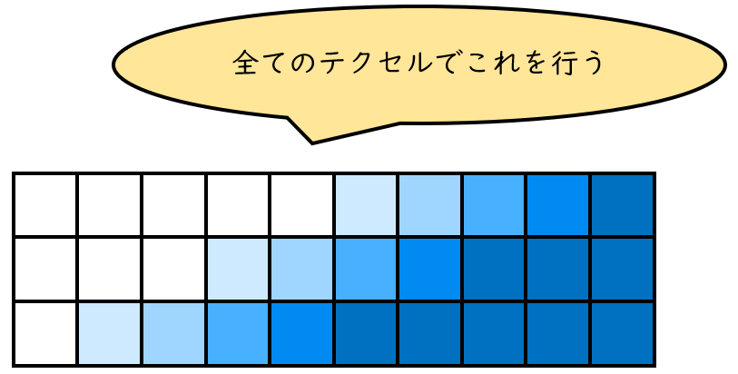   
▼FXAA後。角の部分のジャギーが軽減されている。
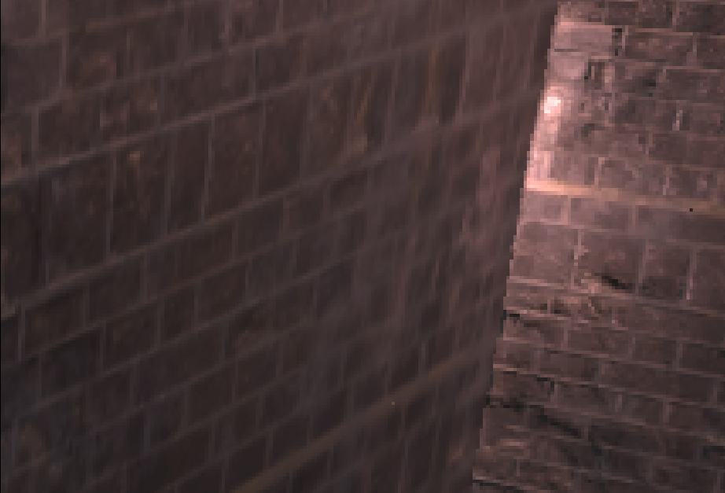 

## 6.C++とPythonの連携
本作品では、**敵の行動をPythonで管理**している。C++側で関数の定義をし、Python側で、定義された関数を呼び出す仕組みだ。 

手順は以下である。  
1.まず、C++側で関数を定義する。 
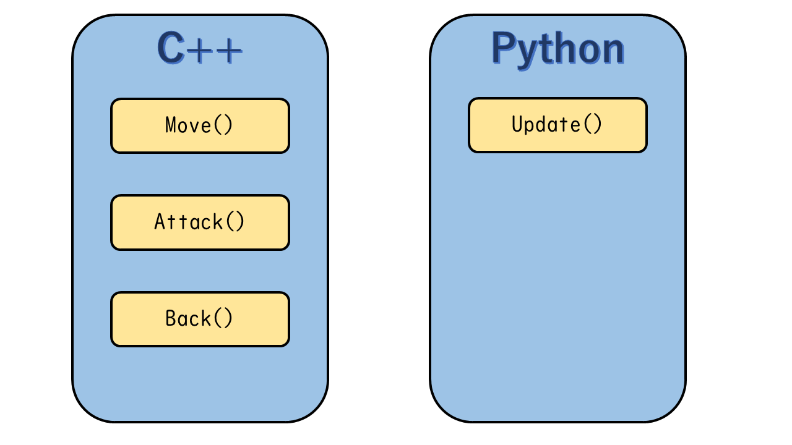 
2.関数定義をPython側に登録する。 
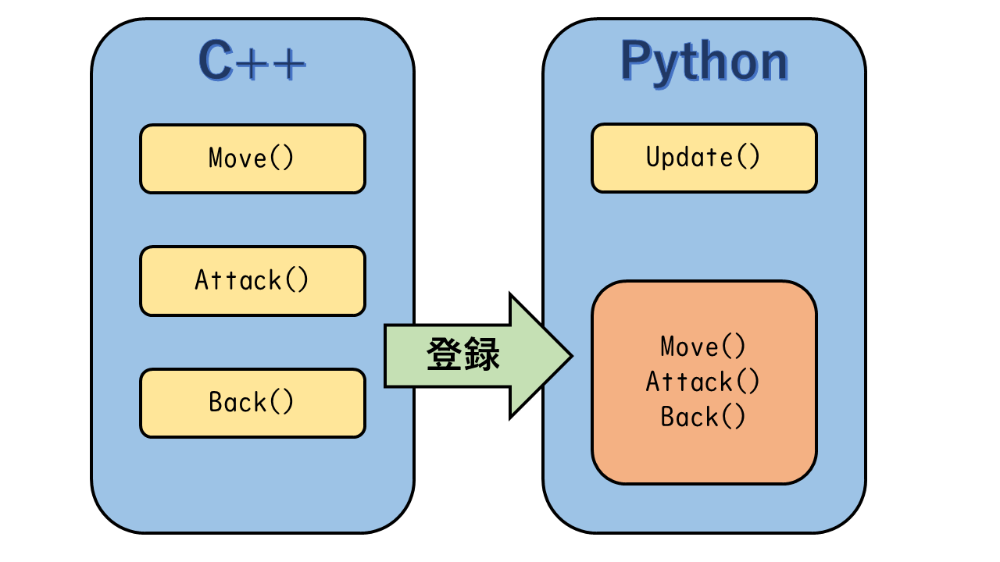 
3.Python側は関数をインポートし、Update()内で指定した関数を呼び出す。 
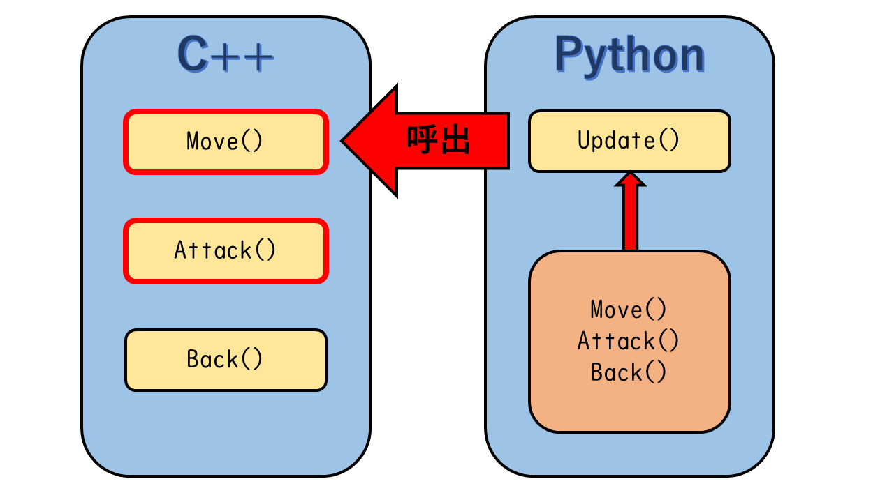  

この手順は一見無駄なように感じられる。しかし、これにはメリットがある。それは、**Pythonの方がコードを改造するのに安全だということだ**。この作品の目的の一つとして、**敵の行動を自分でカスタマイズできる**ようにするというものがある。難易度も、敵の攻撃スピードやパターンを変更することで調整でき、自分のスタイルにあったゲームに変えられるのだ。 
しかし、プログラミングの経験がない方に、C++のコードを改造させるのは難しい。そこで、「どの関数がどのような働きをするのか」、そこまではこちらで記しておき、コードの書きやすいPythonを介する（かつ、Update()ただ一つの中で完結させる）ことにした。すると、改造に必要なことは、用意された関数を呼び出すことだけで済むのだ。もちろん、敵の行動を管理する中で、クールタイム等を変更したり、行動パターンをランダムに変えたりすることだってできる。[^3] 

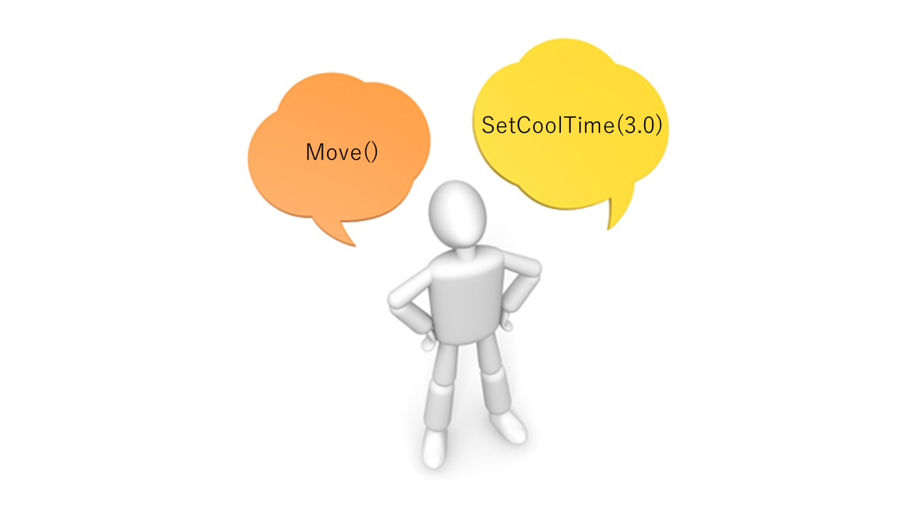 

   

# こだわり・工夫した点・苦労した点

## 1.IBLについて
本作品は、空気感を少しでも良くするために、映り込み表現として**IBL（イメージベースドライティング）** を実装している。
IBLは、最も簡単に実装できる映り込み表現だと言えるだろう。
手順は以下のようになる。 
1.移り込ませるテクスチャを用意する（本作品はスカイキューブを使っている） 
2.IBLで用いる輝度を設定する 
------------------------ここからシェーダー側------------------------  
3.視線（シーンカメラ）からの反射ベクトルを求める   
4.そのピクセルに該当するオブジェクトの滑らかさから映り込みの度合を求める 
5.反射ベクトルと、映り込みの度合いから、移り込ませるテクスチャをサンプリングし、ピクセルのテクスチャカラーとIBLで設定しているテクスチャと輝度をそれぞれ乗算する 
6.そのピクセルのライトのカラーに加算する   

このIBLを実装しようと思った理由は、床や壁に不気味な空が映ると雰囲気がでると思ったからである。ただ、床や壁は滑らかとは言えず、テクスチャカラーも暗かったため、綺麗な表現にはならなかった。 
▼赤い月を移り込ませたかったが、床や壁のカラー、質から上手く映らなかった
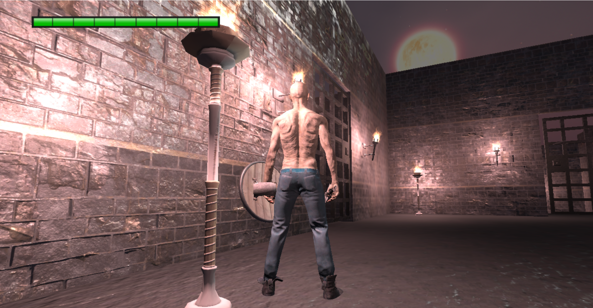  

## 2.ボス戦時のカメラの揺れ
ボス戦は盛り上げる形にしたかった。BGMもそうだが、雰囲気づくりにもう少し踏み込みたかった。
ボスは通常の敵と違い、ジャンプ攻撃を仕掛けてくることがある。そこで、地面に着地した時にカメラを揺らす演出を入れた。 
  
基本的にこのゲームはプレイヤーを中心にカメラが動く。なので、カメラの動き（画面の動き）は操作している人にとって大方予測できるのだ。カメラを揺らし、不規則に画面を動かすことで、臨場感を底上げした。  

## 3.調整を重ねたグラフィック
本作品の魅力は何といってもグラフィックである。ゲームの空気感に合うように、違和感がでないように、[PBR](#1pbr物理ベースレンダリング)を上手く使った。剣や盾は木材部分と金属部分で滑らかさや金属度を、床や壁は反射しすぎないように滑らかさを調整した。 
  
[^1]: 深度値テクスチャは、シェーダー側では読み込むだけなのでシェーダーリソースビューで十分だが、UAVに関してはシェーダー側で情報を書き込む必要があるため、アンオーダーアクセスビューに指定しなくてはいけない
[^2]: 共有メモリの初期化を行う前に他のスレッドが最大深度・最小深度の更新を行うのを防ぐため
[^3]: 敵の動き（呼び出されるpythonファイル）はステートで管理されているため、ステートを変更するだけで行動を変えられる。